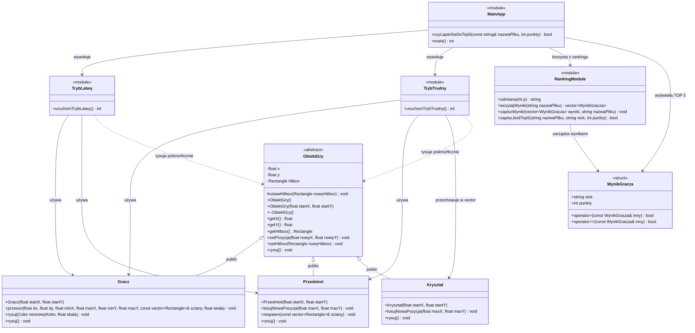

# Schemat klas UML — NeonCat

```mermaid
classDiagram
    class ObiektGry {
        <<abstract>>
        -float x
        -float y
        -Rectangle hitbox
        #ustawHitbox(Rectangle nowyHitbox) void
        +ObiektGry()
        +ObiektGry(float startX, float startY)
        +~ObiektGry()*
        +getX() float
        +getY() float
        +getHitbox() Rectangle
        +setPozycja(float nowyX, float nowyY) void
        +setHitbox(Rectangle nowyHitbox) void
        +rysuj()* void
    }

    class Gracz {
        +Gracz(float startX, float startY)
        +przesun(float dx, float dy, float minX, float maxX, float minY, float maxY, const vector~Rectangle~& sciany, float skala) void
        +rysuj(Color neonowyKolor, float skala) void
        +rysuj() void
    }

    class Przedmiot {
        +Przedmiot(float startX, float startY)
        +losujNowaPozycja(float maxX, float maxY) void
        +respawn(const vector~Rectangle~& sciany) void
        +rysuj() void
    }

    class Kryształ {
        +Kryształ(float startX, float startY)
        +losujNowaPozycja(float maxX, float maxY) void
        +rysuj() void
    }

    class WynikGracza {
        <<struct>>
        +string nick
        +int punkty
        +operator>(const WynikGracza& inny) bool
        +operator==(const WynikGracza& inny) bool
    }

    class TrybLatwy {
        <<module>>
        +uruchomTrybLatwy() int
    }

    class TrybTrudny {
        <<module>>
        +uruchomTrybTrudny() int
    }

    class RankingModule {
        <<module>>
        +odmiana(int p) string
        +wczytajWyniki(string nazwaPliku) vector~WynikGracza~
        +zapiszWyniki(vector~WynikGracza~ wyniki, string nazwaPliku) void
        +zapiszJesliTop5(string nazwaPliku, string nick, int punkty) bool
    }

    class MainApp {
        <<module>>
        +czyLapieSieDoTop5(const string& nazwaPliku, int punkty) bool
        +main() int
    }

    ObiektGry <|-- Gracz : public
    ObiektGry <|-- Przedmiot : public
    ObiektGry <|-- Kryształ : public

    TrybLatwy --> Gracz : używa
    TrybLatwy --> Przedmiot : używa
    TrybLatwy ..> ObiektGry : rysuje polimorficznie

    TrybTrudny --> Gracz : używa
    TrybTrudny --> Przedmiot : używa
    TrybTrudny --> Kryształ : przechowuje w vector
    TrybTrudny ..> ObiektGry : rysuje polimorficznie

    RankingModule --> WynikGracza : zarządza wynikami
    MainApp --> TrybLatwy : wywołuje
    MainApp --> TrybTrudny : wywołuje
    MainApp --> RankingModule : korzysta z rankingu
    MainApp --> WynikGracza : wyświetla TOP 5
```